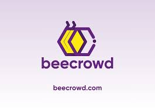
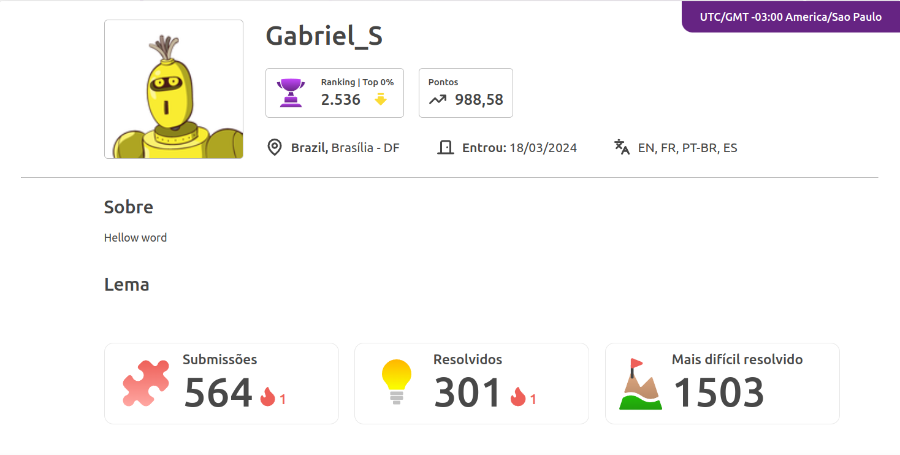

# 🎉 Bem-vindo ao Meu Repositório do Beecrowd! 🎉

## 🌟 Sobre o Beecrowd

Beecrowd é uma plataforma incrível para aprender e praticar programação. Com muitos desafios e exercícios, você pode melhorar suas habilidades de forma divertida e interativa.

🔗 [Visite o site do Beecrowd](https://www.beecrowd.com)  

---

## 👤 Perfil: Gabriel_S

Olá! Eu sou o Gabriel_S, e estou muito feliz em compartilhar meu progresso e projetos com você. Aqui você encontrará uma coleção dos meus melhores trabalhos e implementações de diversos métodos que aprendi.

📸  
 

🔝 Estou entre os melhores da plataforma!

---

## 📂 Implementando

Neste repositório, você encontrará uma pasta chamada `implementando`, onde estou testando vários métodos aprendidos ao longo do curso na prática. Estes incluem:

- 🔢 Escalonamento de Gauss
- 📋 Implementação de lista em linguagem C

Explore e veja como estou aplicando esses conceitos na prática!

---

🎓 [Acesse a pasta Implementando](./Implementando)

